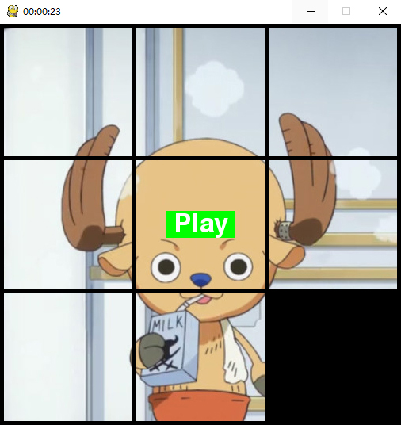

# 滑动拼图
基于python实现的滑动拼图
## 运行
```
pip install pygame
python3 main.py
```

## 操作
左键移动拼图，可一次移动多个<br>
右键显示原图<br>
R键重新开始
## 个性化
图片路径在images/map.jpg，程序根据图片大小自动显示<br>
所有参数都可以在settings.py中更改
```python
# 部分参数
self.map_size = 3               # 滑块数量，3就是3*3大小的拼图
self.block_space = 5            # 滑块之间的间距
self.background = (0, 0, 0)     # 背景颜色
```